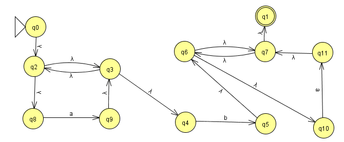
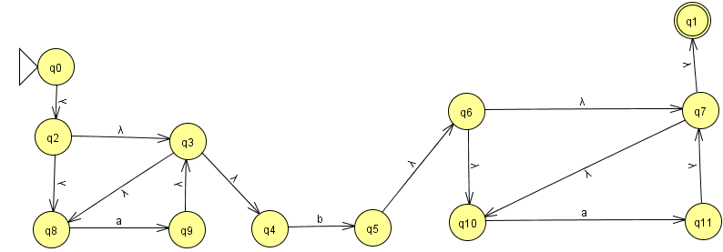
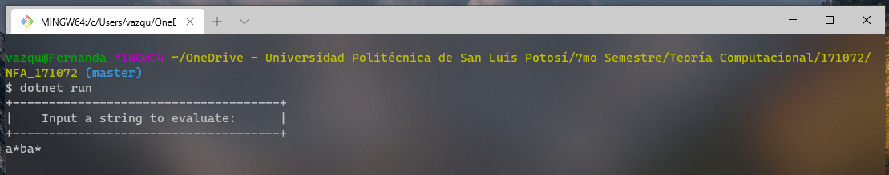
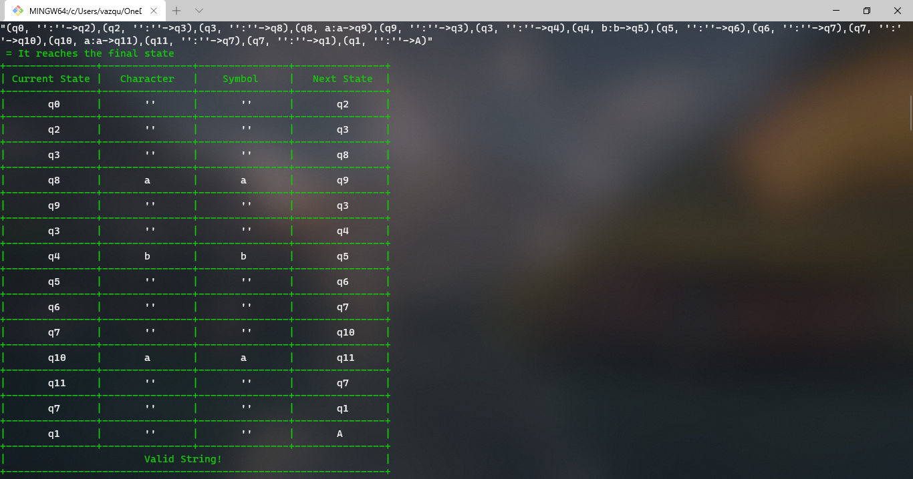
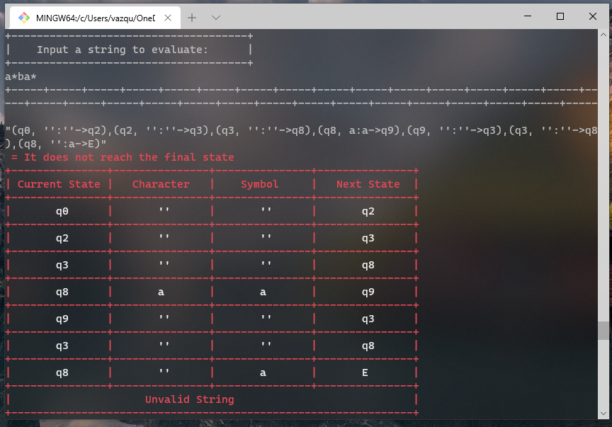

## F# Program about Finite Non - Deterministic Automaton

 *              Name:    Rodolfo Emanuel Vázquez Reyes
 *      Collaborator:    Juan Gerardo Montalvo Becerra - 170441
 *             Major:    IT Engineering
 *       Institution:    Universidad Politécnica de San Luis Potosí
 *         Professor:    Juan Carlos González Ibarra
 *       Description:    F# language program to perform Non-Deterministic Finite Automaton.         
 *           Written:    15/09/2020

## Collabotator's Repository 
This program was developed by me and by my friend Juan Gerardo Montalvo Becerra at 
[ GitHub - Juan Gerardo Montalvo ]( https://github.com/upslp-teoriacomputacional/170441)

## About this Program 
This was the fourth F# program directly translated from Python and modified to a Non Deterministic automaton from a given DFA. 
The purpose of this program was to illustrate how string validation works in Finite NON - deterministic Automatons across 
different programming languages. 

For me, this program was not so difficult to modify since we could work in groups. The most difficulit part was not using the
library of regular Expressions, since my collaborator had an idea on how to approach this problem without the library, we gave it a shot.

First, a state diagram is given. 

From this diagram, we can tell that this is a Nondeterministic Finite Automaton. 
After implementing this diagram to code, a serious challenge we faced was that in the states "q2->q3" and "q6->q7" if executed, produced a stack overflow from recursion. 
<br>
The solution for this consisted of changing one transition in each case in order to avoid cycles. Instead of q3 returning to q2, q3 is now directed to q8 and q7 is now directed to q7.
 It is important to show that this is still a Nondeterministic Finite automaton.
 From this diagram, and after dividing the transition tables into two tables, everything else follows.


The test input is: E(r): a*ba*
In order for the implemententation of NFA to be made, concepts and topics regarding NonDeterministic Finite Automatons must be understood. 
I dit not understood quite well about mutable variables, and regular expressions were definitely a pain in the neck.

For running this program I used .NET tools.
I ran this program from a Git Bash console; the terminal must be opened in the location of the program and .Net must also
be installed on the system. The command "dotnet run" must be used for the program to be executed. 

## Solutions


## Link 1
[ This article ](http://swtch.com/~rsc/regexp/regexp1.html)
simply explains regular Expressions used in different NFAs across different programming languages. 

## Link 2
I found information on how to check Regular Expressions by character input in F# at [ Regular Expressions in F# ](https://docs.microsoft.com/en-us/dotnet/api/system.text.regularexpressions?view=netcore-3.1).

## Link 3
This is a [source language](http://t0yv0.blogspot.com/2011/02/home-made-regular-expressions-in-f.html) that shows how to immplement a NFA in F#. First, the regular expressions themselves: the source language can be nicely described with a union type, encompassing the empty string, choice, concatenation, the Kleene star, and a token parser.


## Link 4
I read some examples on forums and I read something about "mutable variables". I learned how to 
use them at [Mutable variables in F#]( https://docs.microsoft.com/en-us/dotnet/fsharp/language-reference/values/#:~:text=of%20functional%20programming.-,Mutable%20Variables,be%20modified%20in%20incorrect%20ways. ).


## OUTPUT FROM TERMINAL
After long nights and mornings of writing and translating the code, the Automaton was a success!!!
First Line, waiting for input string
 

Valid String with accepted states


Unvalid string with error states


## Source Code
```F#
open System
   // Since F# does not support charcacters in tables, numbers must be defined. 

   //   Accepted State = 5 
   //   Error = 4 
   //   Transition States = 1,2,3 

//  Two transition tables are defined because the diagram states are able to go towards two different states
let transitionT = [ [2;-1;-1]; [-10;-1;-1]; [3;-1;-1]; [8;-1;-1]; [-1;-1;5]; [6;-1;-1]; [7;-1;-1]; [1;-1;-1]; [-1;9;-1]; [3;-1;-1]; [-1;11;-1]; [7;-1;-1] ]
let transitionT2 = [ [-1;-1;-1]; [-1;-1;-1]; [8;-1;-1]; [4;-1;-1]; [-1;-1;-1]; [-1;-1;-1]; [10;-1;-1]; [10;-1;-1]; [-1;-1;-1]; [-1;-1;-1]; [-1;-1;-1]; [-1;-1;-1] ]

//  Matching function  (Function Made by Vazquez Reyes Rodolfo Emanuel)
(*
*  -------------------------------------------------------------------------------------------
*  Functions must also be written before the main argument. Otherwise, the program will not work.
*)
let caracter (mtch:string) :string =
    //  match evaluates the first char of the string and returns the same value
    match mtch with 
        | head when head.StartsWith("a") -> "a"
        | head when head.StartsWith("b") -> "b"
        | head when head.StartsWith("") -> "''"
        | _ -> exit(0)

//  Prints a visible separation in the output (Function Made by Vazquez Reyes Rodolfo Emanuel)
let body () = 
    for x in [0 .. 30] do
        if x % 2 = 0 then
            printf "+-----"
        else
            printf "+-----"
    printfn ""

//  This function prints a transition table for the evaluated input string (Function Made by Vazquez Reyes Rodolfo Emanuel & Montalvo Becerra Juan Gerardo)
let transitionTable (cd:string)(accepted:bool) =
    //  Mutable variables are defineds
    let mutable key = cd
    let mutable color = ConsoleColor.White 
    let mutable temp = ""
    
    if accepted then //   The color of the output table will change depending in the Accepted or rejected State.
        color <- ConsoleColor.Green
    else
        color <- ConsoleColor.Red
    Console.ForegroundColor<-color

    printfn "+---------------+---------------+---------------+---------------+"
    printfn "| Current State |   Character   |    Symbol     |   Next State  |"


    while not (key.Equals("")) do // Try Catch statement is used to remove characters from input
        try
            temp <- key.Remove (key.IndexOf(")")+1)
        with
          | :? System.ArgumentOutOfRangeException -> temp <- key
        try
            key <- key.Remove (key.IndexOf("("),key.IndexOf(")")+2)
        with
          | :? System.ArgumentOutOfRangeException -> key <- key.Remove (key.IndexOf("("),key.IndexOf(")")+1)
        Console.ForegroundColor<-color
        printfn "+---------------+---------------+---------------+---------------+"
        printf "|" 
        Console.ForegroundColor<-ConsoleColor.White
        printf "\t%s\t" (temp.Substring(1,temp.IndexOf(",")-1)) 
        Console.ForegroundColor<-color
        printf "|"
        Console.ForegroundColor<-ConsoleColor.White 
        printf "\t%s\t"  (temp.Substring(temp.IndexOf(" ")+1,temp.IndexOf(":")-temp.IndexOf(" ")-1)) 
        Console.ForegroundColor<-color
        printf "|" 
        Console.ForegroundColor<-ConsoleColor.White
        printf "\t%s\t" (temp.Substring(temp.IndexOf(":")+1,temp.IndexOf("-")-temp.IndexOf(":")-1)) 
        Console.ForegroundColor<-color
        printf "|" 
        Console.ForegroundColor<-ConsoleColor.White
        printf "\t%s\t"  (temp.Substring(temp.IndexOf(">")+1,temp.IndexOf(")")-temp.IndexOf(">")-1))
        Console.ForegroundColor<-color
        printfn "|" 
    //  At the end, it displays if the string was valid or not
    if accepted then
        printfn "+---------------+---------------+---------------+---------------+"
        printfn "|                       Valid String!                           |"
        printfn "+---------------------------------------------------------------+"
    else
        printfn "+---------------+---------------+---------------+---------------+"
        printfn "|                     Unvalid String                            |"
        printfn "+---------------------------------------------------------------+"
    Console.ForegroundColor<-ConsoleColor.White


//  Recursive function that display every posible way for the String in the NFA written by Montalvo Becerra Juan Gerardo and Vazquez Reyes Rodolfo Emanuel
let rec node (nodo:int) (cad:string) (state:string) =
    //  Variables that receives current state and follows the next state
    let mutable st = ""
    let mutable proof = ""
    
    try
        proof <- state.Remove(0,state.Length-2) //  Since the very first node is empty we call a try catch statement that ignores the code in the first run
        proof <- proof.Remove 1
    with
      | :? System.ArgumentOutOfRangeException -> printf ""
  
    if (proof.Equals("A")) then //  If the string has accepted staes, it reaches the final state
        body ()
        printfn "%A" state
        Console.ForegroundColor<-ConsoleColor.Green
        printfn " = It reaches the final state"
        Console.ForegroundColor<-ConsoleColor.White
        transitionTable state true
    
    elif (proof.Equals("E")) then //  If the string is not accepted, it tells the user.
        body ()
        printfn "%A" state
        Console.ForegroundColor<-ConsoleColor.Red
        printfn " = It does not reach the final state"
        Console.ForegroundColor<-ConsoleColor.White
        transitionTable state false
       
    else // Recursion is used if the states are not accepted nor rejected.
        let mutable chain = ""
        let result = caracter cad //  Uses the function match on the cad string
        
        if (transitionT.[nodo].[1] <> -1) then //  When the node is on q8 or q10
            if result.Equals("a") then //  If it is equal to a then it continues to the follwing state
                st <- state + "(q" + string nodo + ", " + result + ":a" + "->" + "q" + string transitionT.[nodo].[1] + ")," 
                node (transitionT.[nodo].[1]) (cad.Remove(0,1)) (st)
            else //  If it's not on q8 or q10, it finishes with an error.   
                st <- state + "(q" + string nodo + ", " + result + ":a" + "->" + "E)" 
                node (transitionT.[nodo].[1]) (cad) (st) 
        elif (transitionT.[nodo].[2] <> -1) then //  When the state is on q4 
            if result.Equals("b") then //  If it is equal to b then it continues to the follwing state
                st <- state + "(q" + string nodo + ", " + result + ":b" + "->" + "q" + string transitionT.[nodo].[2] + ")," 
                node (transitionT.[nodo].[2]) (cad.Remove(0,1)) (st) 
            else //  If it's not on q4, it finishes with an error. 
                st <- state + "(q" + string nodo + ", " + result + ":b" + "->" + "E)" 
                node (transitionT.[nodo].[2]) (cad) (st) 
        elif (transitionT.[nodo].[0] = -10) then //  When the state is on q1
            if result.Equals("''") then //  If it is equal to '' then it accepts the input
                st <- state + "(q" + string nodo + ", " + result + ":''" + "->" + "A)" 
                node (transitionT.[nodo].[0]) (cad) (st)  
            else //  If it's not equal, it finishes with an error.   
                st <- state + "(q" + string nodo + ", " + result + ":''" + "->" + "E)" 
                node (transitionT.[nodo].[0]) (cad) (st) 
        else
            st <- state + "(q" + string nodo + ", '':''->" + "q" + string transitionT.[nodo].[0] + ")," //  If the state contains a lambda, no comparison is made
            node (transitionT.[nodo].[0]) (cad) (st)
            if (transitionT2.[nodo].[0] <> -1) then //  If the state has a second state then it calls to another srecursive node
                st <- state + "(q" + string nodo + ", '':''->" + "q" + string transitionT2.[nodo].[0] + "),"
                node (transitionT2.[nodo].[0]) (cad) (st)
[<EntryPoint>]
//  Main code
let main argv =       
    printfn"+-------------------------------------+"
    printfn"|    Input a string to evaluate:      |"
    printfn"+-------------------------------------+"
    let cadena = Console.ReadLine()  //  This command stores keyboard input
        node (0) (cadena) ("") //       Calls for the node function which performs the string evaluation
    0 // return an integer exit code

## License
[MIT](https://choosealicense.com/licenses/mit/)
