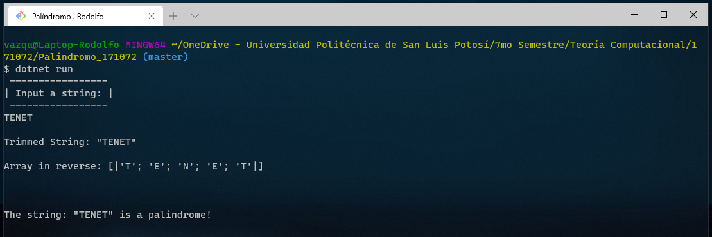
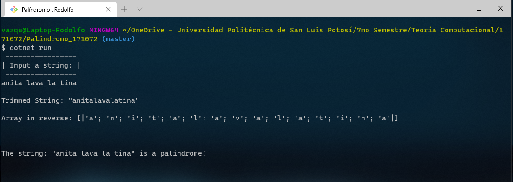
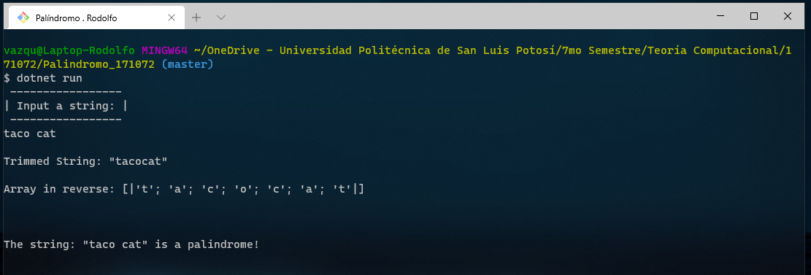
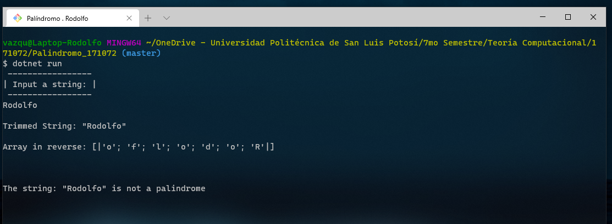

## F# Program about Palindromes

 *              Name:    Rodolfo Emanuel Vázquez Reyes
 *             Major:    IT Engineering
 *       Institution:    Universidad Politécnica de San Luis Potosí
 *         Professor:    Juan Carlos González Ibarra
 *       Description:    F# language program to perform operations on strings to evaluate is they are palindromes.         
 *           Written:    04/11/2020

## About this Program 
This was my sixth F# program.

The purpose of this program was to illustrate how string operations are excecuted to show if a string is a palindrome or not. 

Although this program is only 40 lines long, it was a little tricky to find solutions such as the Array.rev operation. After this was understood, the rest was faster to implement. 

For running this program I used .NET tools.
I ran this program from a Git Bash console; the terminal must be opened in the location of the program and .Net must also
be installed on the system. The command "dotnet run" must be used for the program to be executed. 

## Solutions

At first, I thought that some additional code was necessary in order to divide the string in parts and evaluate a just a part of the string and not all of it. 

When I checked for the F# documentation regarding arrays, I found the 'rev' module, which generates a new array by reversing the order of an existing array. With this, I could just compare the first string to the other string in reverse. 


## Link 1
[ This article ](https://docs.microsoft.com/en-us/dotnet/fsharp/language-reference/arrays)
 explains operations and modules on different arrays. 


## OUTPUT FROM TERMINAL
After a short time, the palindrome checker was a success!
It is important to note that this program should work with any string. 
First string: "TENET"
 

Second string "anita lava la tina"
  

Third string "taco cat"


Fourth String "Rodolfo"



## License
[MIT](https://choosealicense.com/licenses/mit/)


## Source Code
```F#
open System //  Nice try  No me copies, por favor (-:

let isPalindrome (testString: string) =
    let trimString = testString.Replace(" ", ""); //  Removes spaces if it finds spaces.
    let array = trimString.ToCharArray()// Saves the string as an array to 'array' variable
    
    printfn "\nTrimmed String: %A \n" trimString  //  Shows how the program interprets the character
    let reverse = Array.rev array // Reverse will be used to show the array in reverse
    printfn "Array in reverse: %A\n" reverse  // Prints the array in reverse

    if array=reverse then  //   if  condition to perform a comparison between both variables 
        printf "\n\nThe string: %A is a palindrome!\n\n\n" testString  //  if true, shows a positive message
    else printf "\n\nThe string: %A is not a palindrome\n\n\n" testString // else, shows that the string was not a palindrome. 

[<EntryPoint>]
let main argv =
    printfn " ----------------- "
    printfn "| Input a string: |"
    printfn " ----------------- "
    let testString = System.Console.ReadLine() //  Reads user input 
    isPalindrome(testString) //  calls to the 'isPalindrome' Function
    
    0 // return an integer exit code