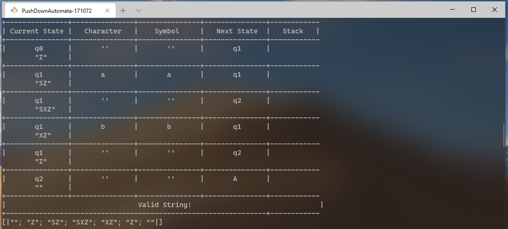

## F# Program about Pushdown Automaton using Context-Free Languages.

 *              Name:    Rodolfo Emanuel Vázquez Reyes
 *             Major:    IT Engineering
 *       Institution:    Universidad Politécnica de San Luis Potosí
 *         Professor:    Juan Carlos González Ibarra
 *       Description:    F# language program to perform operations on strings to evaluate is they are palindromes.         
 *           Written:    13/11/2020

## About this Program 
This was my seventh F# program.

The purpose of this program was to illustrate how PushDown Automaton operations are excecuted to show validation of a string.

Since the previous program was very similar, Stack Rules were added along with some minor changes to the transitionT and transitionT2 variables.

Changing these were not that complex. For me, the real challenge was about implementing the Stack in the recursive fuction. 

For running this program I used .NET tools.
I ran this program from a Git Bash console; the terminal must be opened in the location of the program and .Net must also
be installed on the system. The command "dotnet run" must be used for the program to be executed. 

## Solutions

Since the previous program checked for valid and non valid, this program checks if its empty or if the program has reached an end.
In order for the implemententation of  to be made, concepts and topics regarding PushDown Automatons must be understood. 
I did not understood quite well about mutable variables, and regular expressions were definitely a pain in the neck.


## Regular Expression Matching Can Be Simple And Fast

[ This article ](http://swtch.com/~rsc/regexp/regexp1.html)
simply explains regular Expressions used in different NFAs across different programming languages. 

## System.Text.RegularExpressions Namespace from .NET Documentation

I found information on how to check Regular Expressions by character input in F# at [ Regular Expressions in F# ](https://docs.microsoft.com/en-us/dotnet/api/system.text.regularexpressions?view=netcore-3.1).

## Home-made Regular Expressions in F#: Thompson NFA

This is a [source language](http://t0yv0.blogspot.com/2011/02/home-made-regular-expressions-in-f.html) that shows how to immplement a NFA in F#. First, the regular expressions themselves: the source language can be nicely described with a union type, encompassing the empty string, choice, concatenation, the Kleene star, and a token parser.


## Mutable Variables
I read some examples on forums and I read something about "mutable variables". I learned how to 
use them at [Mutable variables in F#]( https://docs.microsoft.com/en-us/dotnet/fsharp/language-reference/values/#:~:text=of%20functional%20programming.-,Mutable%20Variables,be%20modified%20in%20incorrect%20ways. ).

## Regular expressions from Rosseta Code

Information about lambda expressions is found [here.](http://rosettacode.org/wiki/Regular_expressions) 


## OUTPUT FROM TERMINAL
After a long, long time, the PDA checker was a success!
It is important to note that this program should work with any string containing an bn characters. 

 


## License
[MIT](https://choosealicense.com/licenses/mit/)


## Source Code
```F#
(*
 * *****************************************************************************
 *        Name:    Rodolfo Emanuel   
 *     Surname:    Vázquez Reyes
 *          ID:    171072
 *       Major:    IT Engineering
 * Institution:    Universidad Politécnica de San Luis Potosí
 *   Professor:    Juan Carlos González Ibarra
 * Description:    F# language program to show PDA operations on a given string
 *                
 *  Written:       13/11/2020
 *  Last updated:  13/11/2020
 **************************************************************************** *)
//  These two libraries must be included. 
open System 
open System.Text.RegularExpressions

(*
    This program has two main goals: 
    1. Validate the Context_free Expression: (anbn|n>=0) 
    2. Use Stack and transition table. 
*)
   // Since F# does not support charcacters in tables, numbers must be defined. 
   //   Accepted State = 5 
   //   Error = 4 
   //   Transition States = 1,2,3 

//  Two transition tables are defined because the diagram states are able to go towards two different states
let stackRule =  [["Z;SZ";"E";"E"];["S;e|Z;e";"S;SX";"X;e"];["E";"E";"E"];]
let transitionT = [ [1;-1;-1]; [1;1;1]; [-10;-1;-1];]
let transitionT2 = [ [-1;-1;-1]; [2;-1;-1]; [-1;-1;-1];]

(*
*  -------------------------------------------------------------------------------------------
*  Functions must also be written before the main argument. Otherwise, the program will not work.
*)
let caracter (mtch:string) :string =
    //  match evaluates the first char of the string and returns the same value
    match mtch with 
        | head when head.StartsWith("a") -> "a"
        | head when head.StartsWith("b") -> "b"
        | head when head.StartsWith("") -> "''"
        | _ -> exit(0)

//  Prints a visible separation in the output
let body () = 
    for x in [0 .. 20] do
        if x % 2 = 0 then
            printf "+-----"
        else
            printf "+-----"
    printfn ""

//  This function prints a transition table for the evaluated input string
let transitionTable (cd:string)(accepted:bool)(hStack:string) =
  
  (*
      hstack() function is used to stack the sequence of input arrays 
      horizontally (i.e. column wise) to make a single array. 
  *)

    //  Mutable variables are defineds
    let mutable key = cd
    let mutable temp = ""
    let mutable recursionLoop = 1
    let hStack = hStack.Split '|'
    
    printfn "+---------------+---------------+---------------+---------------+------------"
    printfn "| Current State |   Character   |    Symbol     |   Next State  |   Stack   |"


    while not (key.Equals("")) do // Try Catch statement is used to remove characters from input
        try
            temp <- key.Remove (key.IndexOf(")")+1)
        with
          | :? System.ArgumentOutOfRangeException -> temp <- key
        try
            key <- key.Remove (key.IndexOf("("),key.IndexOf(")")+2)
        with
          | :? System.ArgumentOutOfRangeException -> key <- key.Remove (key.IndexOf("("),key.IndexOf(")")+1)
        
        printfn "+---------------+---------------+---------------+---------------+------------"
        printf "|" 
        printf "\t%s\t" (temp.Substring(1,temp.IndexOf(",")-1)) 
        printf "|"
        printf "\t%s\t"  (temp.Substring(temp.IndexOf(" ")+1,temp.IndexOf(":")-temp.IndexOf(" ")-1)) 
        printf "|" 
        printf "\t%s\t" (temp.Substring(temp.IndexOf(":")+1,temp.IndexOf("-")-temp.IndexOf(":")-1)) 
        printf "|" 
        printf "\t%s\t"  (temp.Substring(temp.IndexOf(">")+1,temp.IndexOf(")")-temp.IndexOf(">")-1))
        printfn "|" 
        printf "\t%A\t"  (hStack.[recursionLoop])
        printfn "|" 
        recursionLoop <- recursionLoop + 1 // works as a counter
       
    //  At the end, it displays if the string was valid or not
    if accepted then
        printfn "+---------------+---------------+---------------+---------------+------------"
        printfn "|                                Valid String!                               |"
        printfn "+---------------------------------------------------------------+------------"
    else
        printfn "+---------------+---------------+---------------+---------------+------------"
        printfn "|                               Unvalid String                               |"
        printfn "+---------------------------------------------------------------+------------"


let rec node (nodo:int) (cad:string) (state:string)(histStack:string)(stack:string) = // recursive function for each possible string path
    //  Variables that receive current state and follows the next state
    let mutable st = ""
    let mutable runExcecutionTime = ""
    let mutable stack = stack // Stack variable is added
    
    try
        runExcecutionTime <- state.Remove(0,state.Length-2) //  try catch statement  ignores the code in the first run
        runExcecutionTime <- runExcecutionTime.Remove 1
    with
      | :? System.ArgumentOutOfRangeException -> printf ""
  
    if (runExcecutionTime.Equals("A")) then //  If the string has accepted states, it reaches the final state
        body ()
        printfn "%A" state
        printfn " = The stack is now empty"
        transitionTable state true histStack
        histStack.Split '|' |> printfn "%A"
    
    elif (runExcecutionTime.Equals("E")) then //  If the string is not accepted, it tells the user.
        body ()
        printfn "%A" state
        printfn " = It does not reach the final state"
        transitionTable state false histStack
        histStack.Split '|' |> printfn "%A"
       
    else 
        let mutable chain = "" 
        let result = caracter cad //  Uses the function match on the cad string
        let histStack = histStack + "|" + stack
        if (transitionT.[nodo].[1] <> -1 || transitionT.[nodo].[2] <> -1 || transitionT.[nodo].[0] = -10) then // Recursion is used if the states are not accepted nor rejected.
       
            if (transitionT.[nodo].[1] <> -1) then //  Excecutes if equal to A
                if result.Equals("a") then
                    for rule in stackRule.[nodo].[1].Split '|' do
                        try
                            if ((stack.Substring(0,1)) = (rule.Substring(0,1)) ) then
                                stack <- stack.Substring(1)
                                stack <- rule.Substring(rule.IndexOf(";") + 1) + stack
                                st <- state + "(q" + string nodo + ", " + result + ":a" + "->" + "q" + string transitionT.[nodo].[1] + ")," 
                                node (transitionT.[nodo].[1]) (cad.Remove(0,1)) (st) (histStack) (stack)
                        with
                           | :? System.ArgumentOutOfRangeException -> () 
                else //  If not, shows an error
                    st <- state + "(q" + string nodo + ", " + result + ":a" + "->" + "E)" 
                    node (transitionT.[nodo].[1]) (cad) (st) (histStack) (stack)
    
            if (transitionT.[nodo].[2] <> -1) then //  Excecutes if equal to B
               
                if result.Equals("b") then
                    for rule in stackRule.[nodo].[2].Split '|' do
                        try
                            if ((stack.Substring(0,1)) = (rule.Substring(0,1)) ) then
                                if (rule.Substring(rule.Length-1, 1).Equals("e")) then
                                    stack <- stack.Substring(1)
                                st <- state + "(q" + string nodo + ", " + result + ":b" + "->" + "q" + string transitionT.[nodo].[2] + ")," 
                                node (transitionT.[nodo].[2]) (cad.Remove(0,1)) (st) (histStack) (stack)
                        with
                           | :? System.ArgumentOutOfRangeException -> ()     
                else //  If not, shows an error
                    st <- state + "(q" + string nodo + ", " + result + ":b" + "->" + "E)" 
                    node (transitionT.[nodo].[2]) (cad) (st) (histStack) (stack)
            
            if (transitionT.[nodo].[0] = -10) then // When it is finally emmpty, shows that it is accepted.
                
                if result.Equals("''") then
                    st <- state + "(q" + string nodo + ", " + result + ":''" + "->" + "A)" 
                    node (transitionT.[nodo].[0]) (cad) (st) (histStack) (stack)  
                else //  If not, shows an error
                    st <- state + "(q" + string nodo + ", " + result + ":''" + "->" + "E)" 
                    node (transitionT.[nodo].[0]) (cad) (st) (histStack) (stack)
        if (transitionT.[nodo].[0] <> -1 && transitionT.[nodo].[0] <> -10) then //7 If a lambda expression is found, it skips states. 
            for rule in stackRule.[nodo].[0].Split '|' do
                try
                    if ((stack.Substring(0,1)) = (rule.Substring(0,1)) ) then
                        if (rule.Substring(rule.Length-1).Equals("e")) then
                            stack <- stack.Substring(1)
                        else
                            stack <- stack.Substring(1)
                            stack <- rule.Substring(rule.IndexOf(";") + 1) + stack
                        st <- state + "(q" + string nodo + ", '':''->" + "q" + string transitionT.[nodo].[0] + "),"
                        if (transitionT2.[nodo].[0] <> -1) then
                            st <- state + "(q" + string nodo + ", '':''->" + "q" + string transitionT2.[nodo].[0] + "),"
                            node (transitionT2.[nodo].[0]) (cad) (st) (histStack) (stack)
                        node (transitionT.[nodo].[0]) (cad) (st) (histStack) (stack)
                with
                    | :? System.ArgumentOutOfRangeException -> () //  If the node has a second state then it calls to another recursive node
[<EntryPoint>]
//  Main code
let main argv =       
    printfn"+-------------------------------------+"
    printfn"|    Input a string to evaluate:      |"
    printfn"+-------------------------------------+"
    let cadena = Console.ReadLine()  //  This command stores keyboard input
    node (0) (cadena) ("") ("") ("Z")//       Calls for the node function which performs the string evaluation
    0 // return an integer exit code