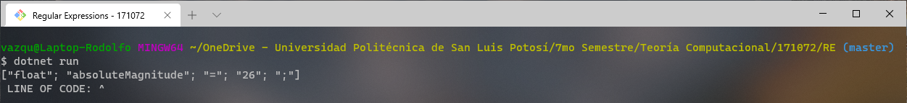

## F# Program about Regular Expressions

 *              Name:    Rodolfo Emanuel Vázquez Reyes
 *             Major:    IT Engineering
 *       Institution:    Universidad Politécnica de San Luis Potosí
 *         Professor:    Juan Carlos González Ibarra
 *       Description:    F# language program to perform Non-Deterministic Finite Automaton.         
 *           Written:    23/09/2020

## About this Program 
This was the fifth F# program directly translated from Python .

The purpose of this program was to illustrate how regular expressions work in branches such as lexicographic analyzers and compilers. 

For me, this program was not so difficult to modify since this program originally was only 43 lines long. 

For running this program I used .NET tools.
I ran this program from a Git Bash console; the terminal must be opened in the location of the program and .Net must also
be installed on the system. The command "dotnet run" must be used for the program to be executed. 

## Solutions


## Link 1
[ This article ](http://swtch.com/~rsc/regexp/regexp1.html)
simply explains regular Expressions used in different NFAs across different programming languages. 

## Link 2
I found information on how to check Regular Expressions by character input in F# at [ Regular Expressions in F# ](https://docs.microsoft.com/en-us/dotnet/api/system.text.regularexpressions?view=netcore-3.1).

## Link 3
This is a [source language](http://t0yv0.blogspot.com/2011/02/home-made-regular-expressions-in-f.html) that shows how to immplement a NFA in F#. First, the regular expressions themselves: the source language can be nicely described with a union type, encompassing the empty string, choice, concatenation, the Kleene star, and a token parser.


## Link 4
I read some examples on forums and I read something about "mutable variables". I learned how to 
use them at [Mutable variables in F#]( https://docs.microsoft.com/en-us/dotnet/fsharp/language-reference/values/#:~:text=of%20functional%20programming.-,Mutable%20Variables,be%20modified%20in%20incorrect%20ways. ).


## OUTPUT FROM TERMINAL
After a short time, the regular expression checker was a success!
Input "variable"
 

## Source Code
```F#
open System.Text.RegularExpressions  //  Regular expressions Library must be included for performing regex expressions. 
open System

//  A mutable variable has to be defined in order for values to change in the progam
let mutable tokens = []     //  For String tokens 

(*---------------------------------------------------------
 *  In programming, a token is a single element of a 
 *  programming language. There are five categories of
 *  tokens: 1) constants, 2) identifiers,
 *  3) operators, 4) separators, and 5) reserved words. 
 *  For example, the reserved words "new" and "function"
 *  are tokens of the JavaScript language.
 *---------------------------------------------------------*)


let sourceCode = "float absoluteMagnitude = 26;".Split(' ')  // A sample "source code" line is given. This will be evaluated

for word in sourceCode do  // A for loop is requiered for each character to be evaluated. 
    if List.exists ((=)word) ["float"; "str"; "int"; "bool"] then //  This line checks for the data type
        tokens <- List.append tokens [word]
    elif Regex.IsMatch(word, "[A-Za-z]") then //  This line checks the name of the given variable
        tokens <- List.append tokens [word]
    elif List.exists ((=)word) ["*";"-";"/";"+";"%";"="] then //  This line checks for the operator 
        tokens <- List.append tokens [word]
    elif Regex.IsMatch (word,"[0-9]") then // This line checks for the value of the given varible. 
        if word.[word.Length - 1] = ';' then
            tokens <- List.append tokens [word.[0..(word.Length-2)]]
            tokens <- List.append tokens [";"]  // This line checks for the semicolon at the end of the line. 
        else
            tokens <- List.append tokens [word]
printfn "%A" tokens // This line prints each token found from an array. 
    

let variablePROLOG(w : byref<string>) : bool=  /// We must write another function that will check for the name of the variable. 
    if (Char.IsLetter(w.[0]) && Char.IsUpper(w.[0]) || w.[0] = '_') then //  This line checks if the first character is Uppercase or underlined . 
        w <- w.[1..(w.Length-1)] //  The first character is removed
        while (not (String.IsNullOrEmpty(w)) && (Char.IsNumber w.[0] || w.[0] = '_')) do //  A while loop condition is added until there are no more elements to be checked. If 
        // if there are still characters in w, if the first character is alphanumeric, it continues. 
            w <- w.[1..(w.Length-1)] // The first character is removed. 
    String.IsNullOrEmpty(w)  

[<EntryPoint>]
let main argv =
    printfn " LINE OF CODE: ^ "
    0 // return an integer exit code

## License
[MIT](https://choosealicense.com/licenses/mit/)
