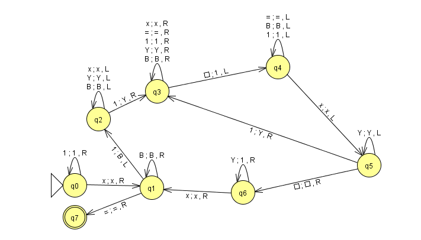
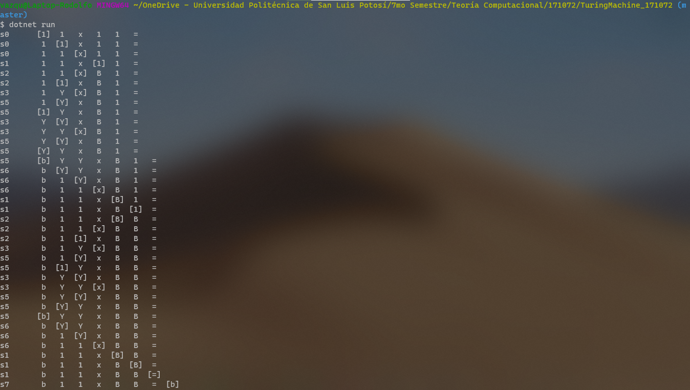

## F# Program about a Turing Machine that multiplies.

 *              Name:    Rodolfo Emanuel Vázquez Reyes
 *             Major:    IT Engineering
 *       Institution:    Universidad Politécnica de San Luis Potosí
 *         Professor:    Juan Carlos González Ibarra
 *       Description:    F# language program to demonstrate how a Turing Machine Multiplies. 
 *           Written:    28/11/2020

## About this Program 
This was my ninth F# program.

The purpose of this program was to illustrate how a Turing machine works given certain rules. 

Translating these lines were not that complex. For me, the real challenge was to understand was the translation of Python dictionaries to F#. 

For running this program I used .NET tools.
I ran this program from a Git Bash console; the terminal must be opened in the location of the program and .Net must also
be installed on the system. The command "dotnet run" must be used for the program to be executed. 

This was the Turing Machine that had to be implemented.

 

## Solutions
The hardest thing to understand was the translation of Python dictionaries to F#. 
Instead, I used lists. 

## Link 1
[ This article ](https://www.jquery-az.com/4-demos-python-if-not-and-not-in-operator/#:~:text=In%20Python%2C%20if%20a%20variable,the%20value%20of%20x%20%3D%200.)
simply explains if not statements in Python. 

## Link 2
I found information on how handle Exceptions using the raise function in F# [ Handling Exceptions in F# ](https://docs.microsoft.com/en-us/dotnet/fsharp/language-reference/exception-handling/the-raise-function).

## Link 3
I read some examples on forums and I read something about "mutable variables". I learned how to 
use them at [Mutable variables in F#]( https://docs.microsoft.com/en-us/dotnet/fsharp/language-reference/values/#:~:text=of%20functional%20programming.-,Mutable%20Variables,be%20modified%20in%20incorrect%20ways. ).

## Link 4
Information about using Lists in F# is found [here.](https://docs.microsoft.com/en-us/dotnet/fsharp/language-reference/lists) 


## OUTPUT FROM TERMINAL
This is the output from the 11 x 1 = multiplication input

 


## License
[MIT](https://choosealicense.com/licenses/mit/)


## Source Code
```F#
open System
exception OuterError of string

let turingM  (state) (blank) (rules:list<list<string>>) (tape:list<string>) (final) (pos) =
    (*
        ------------------------------------
        If a variable is zero, empty or None 
        then it is considered as False.
        -------------------------------------
        The following if statement will
        return true if the condition is False.
    *)
    let mutable st = state  //  States from the TM
    let turingRules = []      //  Transition Rules
    let mutable Break = false
    let mutable tape = tape
    let mutable pos = pos
    let mutable notFound = true
    let mutable turingTape = []  
    (*
        let rules = dict(((s0, v0), (v1, dr, s1)) for (s0, v0, v1, dr, s1) in rules) //  A dicitionary with a for loop is defined
    *)
    let mutable v1 = ""
    let mutable dr = ""
    let mutable s1 = ""
      
    if tape.IsEmpty then //  If tape is true or NOT EMPTY, it will empty the tape. 
        tape <- [blank]
    if pos < 0 then  //  If the position is before 0, the new position will be the length of the tpae
        pos <- pos + tape.Length
    if pos >= tape.Length || pos < 0 then // If the position is after the length of the tape or before 0, it raises an Exception
        raise (OuterError("Wrong Position Inizialization"))
    
    while not Break do                      //  Since break statement does not exist in F#, we use a BOOL variable
        printf "%s\t" st                    //  Head position in staste is shown 
        for i in 0..tape.Length-1 do 
            if i = pos then               
                printf "[%s] " tape.[i]     //  Each character frmo tape is shown
            else                
                printf " %s  " tape.[i]     //  Each character from tape is shown
        printfn ""
       
        if st = final then      //  When the position reaches final state, loop breaks.
            Break <- true
        
        for turingRule in rules do  //  Loop to check if current rule aligns with tape
            if st = turingRule.[0] && tape.[pos] = turingRule.[1] then  
                notFound <- false
        if notFound then
            Break <- true   //  If rule is nor foud, loop breaks.

        if not Break then    //  If loop is not broken, checks for a specific rule.
            for turingRule in rules do 
                //  When a rule is found, values are stored in v1, dr and s1           
                if st = turingRule.[0] && tape.[pos] = turingRule.[1] then
                    v1 <- turingRule.[2] 
                    dr <- turingRule.[3]
                    s1 <- turingRule.[4]
            for x in 0..tape.Length-1 do  // Loop to add a second tape to replace a character from current position 
                if x = pos then
                    turingTape <- turingTape @ [v1]
                else
                    turingTape <- turingTape @ [tape.[x]]
            tape <- turingTape
            
            if dr.Equals("left") then  // the position goes backwards if head equals left and position is above 0 
                if pos > 0 then 
                    pos <- pos - 1                
                else
                    tape <- [blank] @ tape // If not, tape has a new blank symbol
           
            if dr.Equals("right") then  // the position goes forward if head equals right
                pos <- pos + 1 
                if pos >= tape.Length then // If position is greater to size of tape, tape has a new blank symbol
                    tape <- tape @ [blank] 
            st <- s1

[<EntryPoint>]
let main argv =
    
    let turingRules = [ 
              ["s0"; "1"; "1"; "right"; "s0"];
              ["s0"; "x"; "x"; "right"; "s1"];
              ["s1"; "B"; "B"; "right"; "s1"];
              ["s1"; "="; "="; "right"; "s7"];
              ["s1"; "1"; "B"; "left"; "s2"];
              ["s2"; "B"; "B"; "left"; "s2"];
              ["s2"; "Y"; "Y"; "left"; "s2"];
              ["s2"; "x"; "x"; "left"; "s2"];
              ["s2"; "1"; "Y"; "right"; "s3"];
              ["s3"; "B"; "B"; "right"; "s3"];
              ["s3"; "Y"; "Y"; "right"; "s3"];
              ["s3"; "x"; "x"; "right"; "s3"];
              ["s3"; "1"; "1"; "right"; "s3"];
              ["s3"; "="; "="; "right"; "s3"];
              ["s3"; "b"; "1"; "left"; "s3"];
              ["s3"; "B"; "B"; "left"; "s3"];
              ["s3"; "1"; "1"; "left"; "s3"];
              ["s3"; "="; "="; "left"; "s3"];
              ["s3"; "x"; "x"; "left"; "s5"];
              ["s5"; "Y"; "Y"; "left"; "s5"];
              ["s5"; "b"; "b"; "right"; "s6"];
              ["s5"; "1"; "Y"; "right"; "s3"];
              ["s6"; "Y"; "1"; "right"; "s6"];
              ["s6"; "x"; "x"; "right"; "s1"];  
            ]

    turingM ("s0")                   //  Initial State
     ("b")                           //  Blank Symbol   
     (turingRules)                   //  Rules for TM
     (["1";"1";"x";"1";"1";"="])     //  Tape from TM;   
      ("s7")                         //  Final State
       (0)                           //  Position
    0 // return an integer exit code